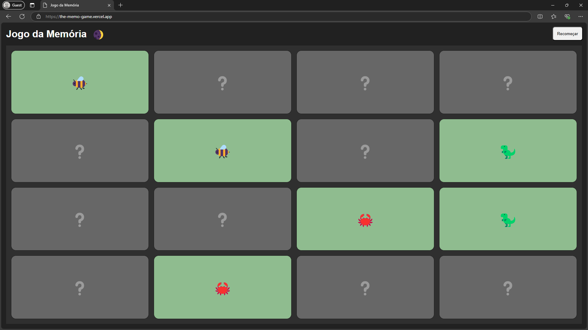

# 🧠 Jogo da Memória

## 🎯 Sobre o projeto

O **Jogo da Memória** é uma aplicação web desenvolvida com **React puro**, criada como parte de um curso para ensinar fundamentos de React. Utiliza **Webpack** e **Babel** para configuração do ambiente e oferece uma experiência interativa com troca de tema (claro/escuro) e um jogo da memória baseado em pares de emojis.

## 🎬 Demonstração

- 🔗 **Acesse o jogo online:** [https://the-memo-game.vercel.app/](https://the-memo-game.vercel.app/)

- 🎨 **Interface do frontend**:

   

## ✨ Funcionalidades

O jogo da memória oferece uma experiência interativa onde os jogadores precisam encontrar pares de cartas idênticas. As principais funcionalidades incluem:

- **Tabuleiro dinâmico**: Cartas são distribuídas aleatoriamente a cada nova partida.
- **Lógica de jogo**: Gerenciamento de virada de cartas, verificação de pares e ocultação de cartas não correspondentes.
- **Controle de estado**: Demonstração clara de como o estado é gerenciado em componentes React para controlar o fluxo do jogo.
- **Reiniciar jogo**: Botão para recomeçar uma nova partida a qualquer momento.
- **Componentização**: O projeto é dividido em componentes reutilizáveis (e.g., `Board`, `Card`) para uma arquitetura modular e de fácil manutenção.
- **Context API**: Utilização da Context API do React para gerenciamento de temas (claro/escuro).

## ⚙️ Tecnologias utilizadas

- **React.js**: Biblioteca JavaScript para construção de interfaces de usuário.
- **Webpack**: Empacotador de módulos para aplicações JavaScript.
- **Babel**: Transpilador JavaScript para garantir compatibilidade com versões mais antigas do navegador.
- **HTML5**: Estrutura semântica da página.
- **CSS3**: Estilização e responsividade.

## 📂 Estrutura do projeto

```text
/javascript_react_memo_game
├── /assets                   
│   └── homepage.png          
├── /dist                   
│   ├── index.html                       
│   └── style.css         
├── /src
│   ├── /components
│   │   ├── Board.jsx
│   │   └── Card.jsx
│   ├── /context
│   │   └── ThemeContext.jsx
│   ├── App.jsx
│   └── index.jsx                        
├── .babelrc                  
├── .gitignore 
├── package-lock.json
├── package.json             
├── webpack.config.js        
└── README.md                
```

## 🚀 Instalação e execução

### 💻 Pré-requisitos

Certifique-se de ter o **Node.js** (versão 14 ou superior) instalado em sua máquina. O npm (Node Package Manager) é incluído automaticamente com a instalação do Node.js.

### ▶️ Passos para execução

Para configurar e rodar o Jogo da Memória em seu ambiente de desenvolvimento local, siga os passos abaixo:

1. **Clone o repositório**:

   ```bash
   git clone https://github.com/marcelomduarte/javascript_react_memo_game.git
   ```

2. **Acesse o diretório**:

   ```bash
   cd javascript_react_memo_game
   ```

3. **Instale as dependências**:

   ```bash
   npm install
   ```

4. **Inicie o servidor de desenvolvimento**:

   ```bash
   npm start
   ```

5. **Acesse o Jogo no navegador**:

   Abra seu navegador e navegue para `http://localhost:8080` para jogar.

### 📦 Build para produção

Para gerar uma versão otimizada do aplicativo para deployment em produção, execute o comando de build. Os arquivos estáticos serão gerados na pasta `./dist`.

   ```bash
   npm run build
   ```

## 🎮 Como jogar

1. Clique em duas cartas para revelá-las;
2. Se as cartas formarem um par, elas permanecerão viradas;
3. Se não formarem par, elas voltarão a ficar ocultas;
4. Continue até encontrar todos os pares;
5. Tente completar no menor tempo e com menos tentativas possível!
